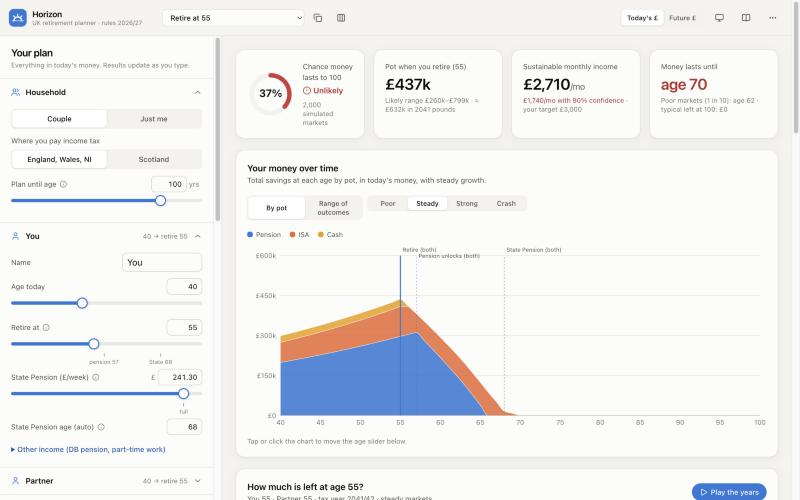

# Horizon — UK retirement planner

**A private, visual retirement planner for UK couples.** Enter your pensions, ISAs, cash and investments, say how much you want to take home each month, and see how long the money lasts. It's built around 2026/27 UK tax rules and tested against thousands of simulated market histories.

**▶ Use it: https://marhala-dotcom.github.io/retirement-planner/**



Everything runs in your browser. Your numbers are saved only on your device (localStorage) and are never uploaded.

## What it answers

- **What will our pot be worth when we retire?** In today's money, with a likely range.
- **How much can we spend each month?** In steady markets and with 90% confidence.
- **How much is left at each age?** Drag the age slider (or press *Play the years*) to see the pot shrink, which wrapper it's in, and where that year's income comes from.
- **What's the chance the money lasts to 100?** Based on 2,000 simulated market histories, with plain-English fan charts and "poor / steady / strong / crash" paths.
- **Should we retire at 55 or 57?** A retirement-age sweep shows the chance of success and sustainable income at each age.
- **How do we bridge to pension access at 57?** Since April 2028 the minimum pension age is 57. Horizon tracks the ISA/cash bridge and the gap until State Pension at 68.

## What's inside

| Area | Details |
|---|---|
| **People** | Single or couple. Each person has their own age, retirement age, State Pension (forecast £/week, State Pension age from date of birth), DB pension, part-time work and protected pension age |
| **Pots** | Pension (SIPP/workplace), Stocks & Shares ISA, GIA (with cost basis for CGT), cash and Lifetime ISA, per person, plus monthly contributions |
| **Tax engine** | Income tax for England/Wales/NI and Scotland, the personal allowance taper, savings starting rate and personal savings allowance, dividend allowance and rates, CGT, employee NI. Thresholds are frozen to 2031, then CPI. Each partner's tax is worked out separately. |
| **Pension rules** | Access age 55→57, 25% tax-free via UFPLS or up front, Lump Sum Allowance, LISA access at 60 |
| **Drawdown** | A tax-smart order: fill both personal allowances from pensions, then cash/GIA, then pension to the basic-rate limit, then ISAs. You can switch to ISAs first or pensions first. Includes Bed & ISA. |
| **Spending** | Monthly net target in today's money, benchmarked against the Retirement Living Standards. Optional later-life spending dip and one-off events (cars, gifts, inheritance, downsizing). |
| **Strategies** | Fixed inflation-linked spending, or flexible Guyton–Klinger-style guardrails with an essential-spending floor |
| **Simulation** | Correlated lognormal equity and bond returns with parameter uncertainty, 500–5,000 runs in a Web Worker, and a crash-at-retirement stress test |
| **Outputs** | KPI tiles, stacked wealth by pot, fan chart, age scrubber gauge, dual-age timeline, income-source bars with tax and shortfall, retirement-age sweep, plain-English insights, and a year-by-year table with CSV export |
| **Scenarios** | Save variations, compare them side by side, and export or import as JSON |

See **[docs/RESEARCH.md](docs/RESEARCH.md)** for the research behind the design: competitor review, UK rule sources, capital market assumptions, withdrawal-rate evidence and the roadmap.

## Development

```bash
npm install
npm run dev      # http://localhost:5173/retirement-planner/
npm test         # engine unit tests (tax bands, pension access, simulation invariants)
npm run build    # type-check + production build into dist/
```

Stack: React 19, TypeScript, Vite, Tailwind CSS 4, Recharts, Vitest. The calculation engine (`src/engine/`) is framework-free TypeScript.

```
src/engine/rules.ts      UK tax & pension constants (update when rules change)
src/engine/tax.ts        per-person income tax, savings/dividend stacking, CGT, NI
src/engine/prepare.ts    plan → per-year arrays (inflation, thresholds, incomes, contributions)
src/engine/simulate.ts   the year-by-year household simulation
src/engine/montecarlo.ts market generation, Monte Carlo summary, solvers
src/engine/worker.ts     runs the heavy work off the main thread
```

## Deployment

Every push to `main` builds and deploys to GitHub Pages via `.github/workflows/deploy.yml`.

## Disclaimer

Horizon is an educational planning tool, not regulated financial advice. Tax rules and allowances change. For important decisions, such as taking tax-free cash or transferring a DB pension, speak to a regulated financial adviser, or use the free government service [Pension Wise](https://www.moneyhelper.org.uk/en/pensions-and-retirement/pension-wise) if you're 50 or over.
